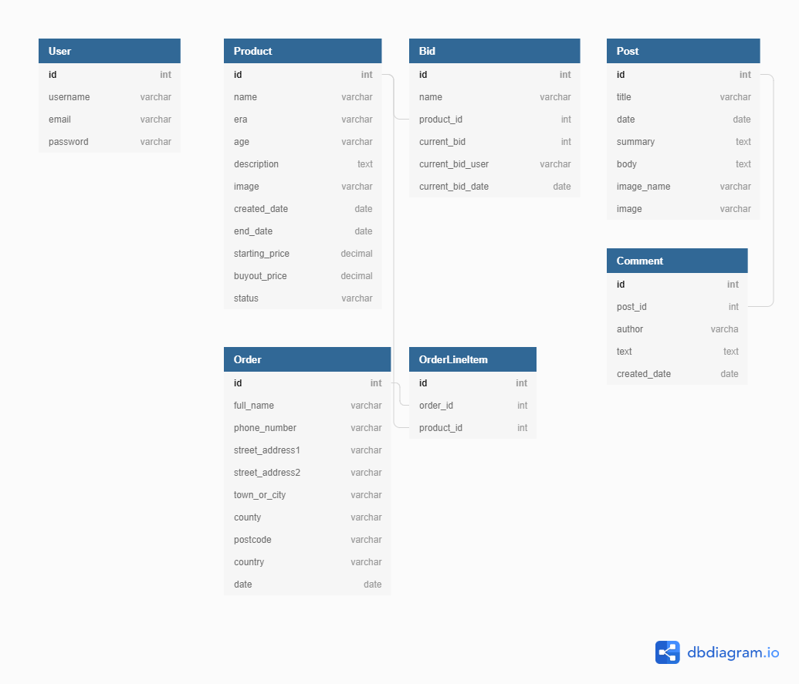

# Artifact Auctioneers - [Website Link](https://ecommerce-msp4.herokuapp.com/)

Artifact Auctioneers is an online auction site where users can find, learn about and acquire artifacts from ancient history.

The company's archeologists scour the globe for artifacts and then present them on the store to be bid on at auction or purchased immediately at a given buyout price.

---

## UX

### User Stories

I began development of this site by putting together user stories. This allowed me to break down each story into a specific feature that would be required within the website. It also served as a way to separate functionality into different apps.

- As a user browsing the site I want to be able to:
    - Find out more information about the company so that I can determine if they are a reputable brand
    - View the latest news on artifact finds from around the world
    - Contact the company should I have a query
    - Access the company's social media should I wish to follow them

- As a user browsing the store I want to be able to:
    - View a list of all artifacts available to be bid on or bought
    - Filter the list of all artifacts available by auction end date or buyout price
    - View a list of specific artifacts based on the era they came from
    - Search for an artifact in the store
    - Select an artifact and view additional information about it
    - Bid on an item in the store and receive confirmation of this via email
    - Purchase an item immediately

- As a user who has added an item to their cart I want to:
    - View the cart to see the items I am about to purchase
    - Remove items from my cart as appropriate
    - Proceed to a checkout page where I can provide my credit card info and shipping information
    - Receive a confirmation via email once the payment has been processed

### Mock Ups

The following [mock ups](https://github.com/njdavies/milestone-project-four/tree/master/docs) were put together to allow me to plan out the content and functionality on each page of the site, taking into account the user stories I had put together. 

### Schema

I then designed a database schema for the various models that would be required within the site. This includes the relationships between the various models

### Theme

I used a dark colour pallette, comprising mainly of black and shades of grey. These colours are often used to market luxury brands to evoke professionalism, and given that the site sells world renowned antiquities at high prices I felt that this was a good match.

The image used on the home page was particularly important to get right, as I wanted something familiar that immediately captured the eye of any visitor. The colours in the image enabled me to use shades of purple for the various buttons and other icons used in the site, as they compliment eachother well. Also of note here is the call to the action button placed in the middle of the image, which immediately takes the user to the store and full listing of all artifacts available, guiding them to the site's goal conversion.

Overall, the site is designed to be as aesthetically pleasing as possible, with the least amount of visual clutter. The store in particular makes heavy use of white backgrounds and spacing, which allows the images of the artifacts and key pricing information to pop out. 

---

## Features

### Existing Features

- Home Page - A call to action button is provided to take the user to the store along with a brief explanation as to how they use the auction.
- Search bar - Allows the user to search for items in the store and provides confirmation message if nothing found
- About Page - This provides information on the origin of the company and its history. This is particularly important to show the company as being a reputable and respected brand.
- Contact Page - Provides company contact information and allows a user to complete a form with a query and submit this. A confirmation email is sent to the user which confirms their query details and advises a turnaround time on the response.
- Blog - This provides news stories on the latest finds by the company's archeologists. It also allows any visitor to the site to add comments to the stories.
- User Authentication - Full registration/login/logout functionality is provided, along with a password reset option. Confirmation emails are sent to the user when an account is created or their password reset. It is made clear to the user on the landing and artifact pages that an account is required in order to bid on or purchase any item in the store.
- Links to the company's various social media offerings are provided 
- Products Page - This lists all items available in the store and can be sorted to show items by their auction end date or buyout price. 
- Era Pages - The artifacts in the store are filtered into their respective eras and shown in their own pages. This allows users only interested in artifacts from a particular era to quickly view the items available.
- Artifact Page - Each artifact has their own page which provides a description and brief history on their past. 
- Bid functionality - Each artifact with an open auction can be bid on by registered users. The bid process is explained by clicking on an information button next to the starting price/current bid. There is also an option to view all bids made. Once a bid is received a confirmation email is sent to the user.
- Buyout functionality - Each artifact can be purchased immediately at the buyout price set. This adds the item to the user's cart.
- Cart Page - The user can view their cart, remove an item and see the total of all items being bought.
- Checkout Page - Provides a form for the user to input shipping/credit card info. A confirmation email is sent to the user once the card details have been accepted.

### Features I would like to have implemented

- Item status automation - It would be more efficient if the status of an item automatically changed to closed once the end date of the auction is reached. Currently, this has to be done manually in the admin site. I did investigate how to achieve this through the use of properties, but unfortunately was unable to get it working within the initial development timeframe. 
- In addition to the above, it would also be helpful if once the end of an auction has been reached, a confirmation email is sent to the winner along with information on how to provide their shipping/credit card information. Currently this would also need to be done manually.
- Another useful feature to add would be an order history page that a user could bring up to view all bids they have made and items purchased.

---

## Technologies Used

In designing and creating this website I have utilised the following tools, languages and frameworks:

- [Pencil](https://pencil.evolus.vn/) - This simple tool let me create wireframes very quickly and aided in visualising how the website would look from the beginning of
  development.
- [dbdiagram.io](https://dbdiagram.io/home) - I used this tool to visualise the database models and the relationships between them
- [HTML5](https://en.wikipedia.org/wiki/HTML5) - I used this language to build the basic structure and elements of the website.
- [CSS3](https://en.wikipedia.org/wiki/Cascading_Style_Sheets) - This language was used to apply styling to the HTML structure, and described how the elements should be displayed.
- [Javascript](https://en.wikipedia.org/wiki/JavaScript) - This language allowed me to make the site interactive by incorporating buttons and applying logic depending on user choices.
- [JQuery](https://en.wikipedia.org/wiki/JQuery) - A Javascript library used to greatly simplify the finding, selecting and manipulation of DOM elements.
- [Python](https://www.python.org/) - I used this language on the backend when working with the database and Django web framework.
- [Django](https://www.djangoproject.com/) - This web framework was used to handle the urls, views and templates for the different pages.
- [Postgresql](https://www.postgresql.org/) - The object-relational database used to store all product, blog and order information.
- [STRIPE](https://stripe.com/gb) - The online payment processing API that handles all transaction functionality when items are purchased on the store
- [GIT](https://git-scm.com/) - The version control system used to track changes in the source code during development
- [AWS](https://aws.amazon.com/websites/) - The static files used in the site are stored in the cloud using this provider
- [Travis CI](https://travis-ci.org/) - The continious integration service used to build and test each push to Github

---

## Testing

### Automated Testing

I wrote tests for the site using the unittest module built into the Python standard library. The tests are saved in the tests .py file under each respective app. I then used the [Coverage.py](https://coverage.readthedocs.io/en/coverage-5.1/) tool to measure how much of the code had been tested. The final figure came to 76%.

In order to use this tool I followed these steps within the terminal:

    $ pip install coverage
    $ coverage run manage.py test (app name)
    $ coverage report

This then provides a percentage based report of the code tested in the app.

For a nice presentation of this information, use the following command to get annotated HTML listings detailing missed lines:

    $ coverage html

A folder called htmlcov is then created in your file directory. Open the index.html file within this folder and run it to see the more visually pleasing report. From there you are able to click on any file within each app and are taken directly to code which is not covered by tests.

I also made use of the following automated tools:

[W3C Markup Validation Service](https://validator.w3.org/) - I used this tool to validate the HTML used within the website. To do this I pasted the website URL (https://ecommerce-msp4.herokuapp.com/) into the address field and hit Check. It will then advise you of any errors within your code and make suggestions regarding how to keep this as correct as possible against the W3C standards.

[W3C CSS Validation Service](https://jigsaw.w3.org/css-validator/) - I used this tool to validate CSS used within the website. To do
this I first selected the 'By direct input' tab and then pasted the entire CSS code from the [style.css](https://github.com/njdavies/milestone-project-four/blob/master/static/css/style.css) file into the box provided. I then hit Check. As per the HTML checker above, if there are any errors in the code these will be highlighted.

[JSHint](https://jshint.com/) - A linter for Javascript which analysed my front end code and highlighted any errors.

[Pylint](https://pypi.org/project/pylint/) - A linter for Python which analysed my back end code and highlighted any errors.

### Manual Testing

I tested the User Stories I had put together by conducting the following scenarios:

- Home Page
  - Select each link in the header and footer and check that the appropriate page is displayed
  - Select the call to action button and check that the products page is displayed
  - Select the 'Sign up now' link and check that the appropriate page is displayed

- Search bar
  - Enter the word 'mask' into the search bar and check that a page is displayed with two items listed
  - Enter the word 'egg' into the search bar and check that a page is displayed that confirms 'No artifacts found'

- Account authentication
  - Attempt to sign up for an account without completing all fields and check that a prompt appears for the missing information
  - Sign up for an account by completing the registration form in full and check that a success message is displayed
  - Check that a confirmation email is received once sign up complete
  - Attempt to log in without completing all fields and check that a prompt appears for the missing information
  - Log in by completing all fields in full
  - Reset your password by selecting the link on the login page and check that an email is received with the appropriate link to do this
  - Check that you are able to log in with the updated password

- About Us Page
  - Check that the page renders correctly

- Contact form
  - Attempt to submit a form without completing all fields and check that a prompt appears for the missing information
  - Submit a form by completing all fields in full and check that a success message is displayed 
  - Check that a confirmation email is received with details of the query submitted

- Blog Page
  - Check that each of the three news stories can be selected and additional information displayed
  - Add a comment to a news story and check that this is displayed correctly
  - Check that you are able to go back to the blog main page by selecting the appropriate button

- Products Page
  - Check that this page displays a paginated list (four items per page) of all artifacts in the store
  - Check that the page you are on is highlighted correctly at the bottom
  - Select both sorting filters are check that these work correctly
  - Select each item in the store and check that this takes you to their specific artifact page

- Era pages
  - Check each era page and confirm that they correctly display only a list of artifacts on the store from that era

- Artifact Page
  - When not logged in or no account set up check that a warning message is displayed which advises the user they will need to register before bidding/buying 
  - Select the 'See all bids' link and check that a list is displayed of all bids made, if any
  - Check that when logged in no warning message appears as per first point
  - Select the information icon and check that an information modal opens up with details on the bidding/buyout process

- Bidding functionality
  - Attempt to bid without entering any amount and check that a prompt appears for the missing information
  - Attempt to enter non numerical values and check that this is not permitted
  - Attempt to enter a value lower than the starting price/current bid value and check that a prompt appears with information provided as to the minimum value allowed
  - Attempt to enter a value higher than the maximum allowable bid (£300,000.00) and check that a prompt appears which confirms the highest value possible

- Buyout functionality 
  - Add an item to the cart by selecting the button, check that the cart icon in the header of the page updates accordingly and that a success message appears.
  - Add another item to the cart and check that the counter updates accordingly

- Cart Page
  - Check that any items added to the cart are displayed 
  - Remove an item from the cart and check that it updates accordingly and a success message is displayed
  - Check that the total figure is correct

- Checkout Page
  - Attempt to submit payment by not completing any of the fields and check that a prompt appears for the missing information
  - Complete the personal details section in full
  - For the payment information enter the following test details:
    - Credit card number - 4242424242424242
    - Security code - 123
    - Month - Any year from 2021 onwards
    - Year - Any year from 2021 onwards
  - Submit the payment, check that the cart empties, a success message is displayed and a confirmation email received which confirms the items purchased and shipping details provided by the user
  - Check that the item/s bought no longer show on the products page

During the development of the site I also made extensive use of Chrome Developer Tools to view the content in different viewport sizes to assess how it was behaving. This then led to me using multiple media queries to make subtle changes to the code so that the content was always displayed correctly.

In order to be completely satisfied that the site worked correctly across multiple browsers I completed the manual testing above after loading the site in Chrome, Internet Explorer, Edge and Firefox.

---

## Deployment

In order to deploy the site I completed the following steps:

1. I created a remote Git repository on GitHub. I then committed and pushed content from my local repository to the remote repository each time I added a new piece of functionality.

2. I linked my Github repository to my Travis CI account by first selecting settings within the Travis Dashboard, selecting the activate button and then selecting the respository I wanted to use with Travis. I then added the following .travis.yml file to my respository to tell Travis CI what to do:

        language: python
        python:
          - "3.8.1"
        before_install:
          - chmod +x manage.py
        install: pip3 install -r requirements.txt
        script:
          - SECRET_KEY="********" ./manage.py test

    This file was then pushed to Github to trigger a Travis CI build. I could then check the build status page to see if every time a new commit was made to Github the build passed or fail according to the return status of the build command by visiting the Travis CI website and selecting my repository. A visual representation of the build status is also present within this readme file, by embedding the url of the build status from the Travis CI website using markdown.

3. I then created a new app within Heroku and linked this to my Github repository by going into the Deploy tab and selecting to deploy by Github. This then prompts you to select the appropriate repository from your GitHub account. You are then able to select from Automatic or Manual deploys. By selecting Automatic deploys it meant that whenever I pushed something to GitHub it automatically triggered a new build within Heroku. This allowed me to continually test the live version of the site in different browsers throughout development, to see how it was responding.

    In the Settings tab within the app in Heroku I selected the Reveal Config Vars tab and input the following environment variables required for the static file, database, email and payment functionality to work correctly:

- AWS_SECRET_KEY_ID
- AWS_SECRET_ACCESS_KEY
- AWS_STORAGE_BUCKET_NAME
- DATABASE_URL
- EMAIL_HOST_PASSWORD
- USER_ID
- SECRET_KEY
- STRIPE_PUBLISHABLE
- STRIPE_SECRET

4. Finally, I created a Procfile and requirements.txt file within my project folder and pushed these to my Git repository. The Procfile contained the following text to instruct Heroku that the application is a python web application: 

        web: gunicorn ecommerce.wsgi --log-file -

      The requirements.txt file was created by running the following command:

        pip freeze > requirements.txt

    This then created a list of the dependencies that my project utilised. Heroku also needs this so that it installs these dependencies for each build.

    To run locally, first create a new workspace in your local computer. Then use the following command to create a local copy of the code:

        $ git clone https://github.com/njdavies/milestone-project-four

    Install the key project dependencies:

        $ pip3 install -r requirements.txt

    Set the environment variables as per the list provided above.

    Then run the app with:

        $ python manage.py runserver

---

## Credits

### Content

1. In working with Django I relied heavily on the official documentation found at the [following site](https://docs.djangoproject.com/en/3.0/)
2. [Django for Beginners](https://djangoforbeginners.com/) - This book provided invaluable guidance when it came to dealing with class based views and writing tests for the different apps
3. [Python Django Tutorial](https://www.youtube.com/watch?v=UmljXZIypDc&list=PL-osiE80TeTtoQCKZ03TU5fNfx2UY6U4p) - This YouTube series was very helpful in explaining how to deploy the site to Heroku and making use of AWS hosting
4. The layout of the contact form is taken from [this](https://bootsnipp.com/snippets/95Oj) template

### Media

The images and historical information used for the products are taken from the [ancient.eu](https://www.ancient.eu/) site

### Acknowledgements

I received inspiration in the design of this project from the following websites:

1. [Live Auctioneers](https://www.liveauctioneers.com/en-gb/)

2. [Catawiki](https://www.catawiki.com/)